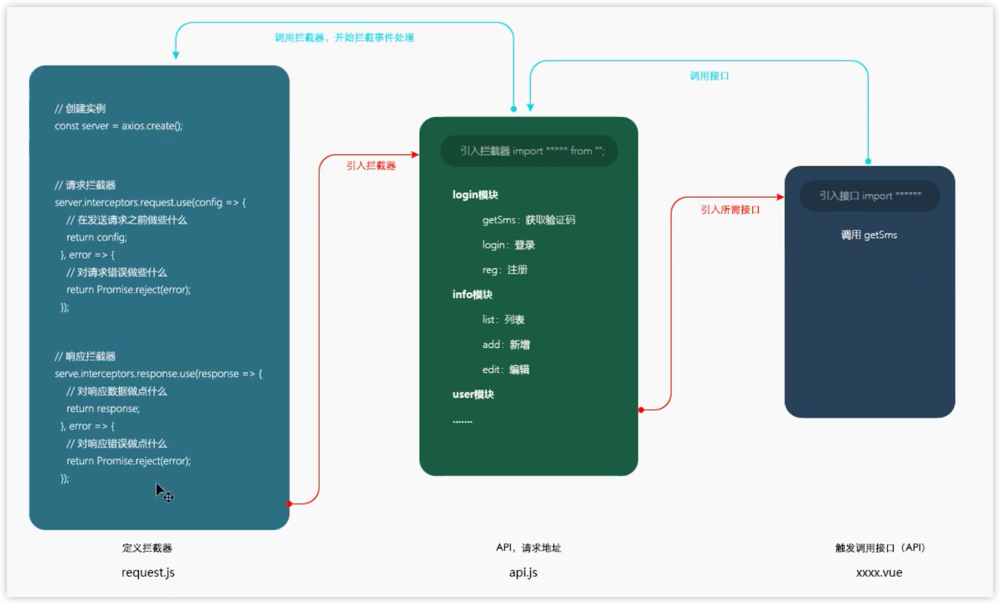
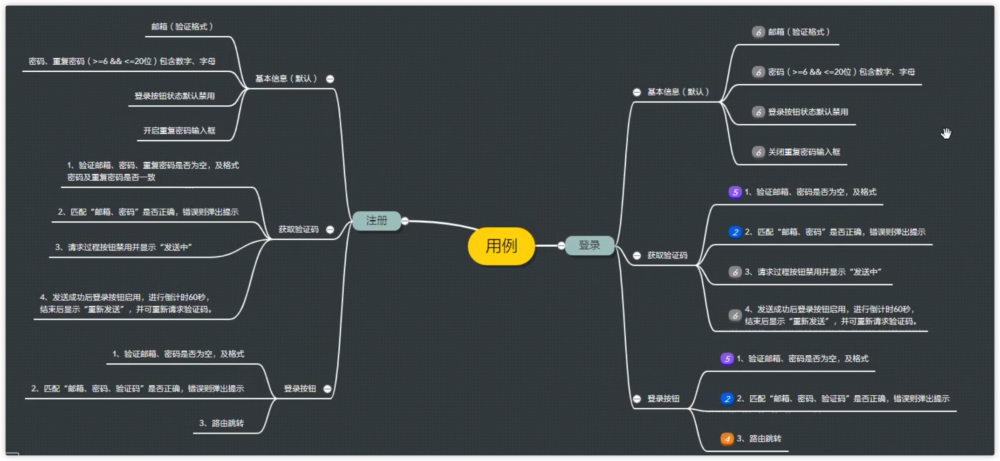
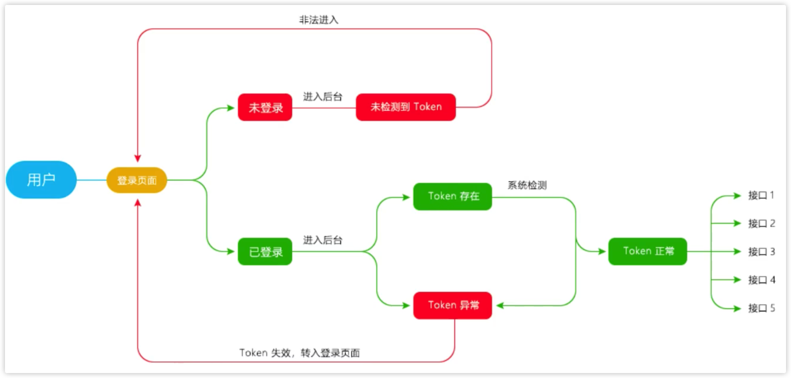

# vue2&vue3搭建管理后台系统知识体系
## 建立项目仓库
### 1. git分支
- master: 主分支，一般不会在此分支上开发项目
- dev: 开发分支，一般在此分支上开发
>版本分支: 建立于dev分支下面
feature-vueAdmin-V1.0.0-20220504: 分支完整名称
feature: 描述当前分支类型(需求)
vueAdmin: 项目名称
V1.0.0: 版本号
20220504: 建立分支日期
>Bug分支: 建立于当前版本分支下面
bug-101241-20220504: bug分支完整名称
bug: 分支类型(BUG)
101241: bug的id
20220504: 建立分支的日期
## 通过脚手架构建vue项目
### 1. 路由选择-hash/history
- hash: 地址栏URL中有 # 符号
- history: 利用了 HTML5 History interface 中新增的 pushState() 和 replaceState() 方法
  - 此方法需要后端Apache 或 Nginx 进行简单的路由配置，否则会报 404

## vue3和vue2目录区别
- 去除了static、config和build目录
- 新增了public目录
- 自动依赖 node_modules
- 默认配置 webpack, 通过 vue.config.js 修改
- vue inspect 可查看webpack 默认配置
- 内置了vue-cli-service serve 服务
- 浏览器打开图形界面， vue ui 查看

## 项目初始化
### 1. 加载全局样式
#### 单位
- vh: 视觉高度，100vh 就是满屏，50vh屏幕的一半
### 2. 路由配置与router重定向
  - 根目录与路由重定向
```javascript
import Login from '@/components/Login.vue';  // 全局引入
export default new Router({
  routes: [
    {
      path: '/', 
      redirect: 'login'
    }
    {
      path: '/index',
      name: 'Home', 
      component: () => import('@/components/Home.vue')  // 按需导入
    },
    {
      path: '/login',
      name: 'Login',
      component: Login
    }
  ]
})
```
### 3. 程序入口main.js(vue2)
- 在main.js中
```javascript
import Vue from 'vue'
import App from './App.vue'
import router from './router'
import store from './store'
Vue.config.productionTip = fasle
new Vue({
  router,
  store,
  render: h -> h(App)
}).$mount('#app')
``` 
- 实例化Vue并添加router,store以及渲染App.vue首页
- 将整个实例化的对象放到 public/index.html 中 id 为 app的节点，塞入body中
- 之后的组件或者页面，都放入到 App.vue 中
- main.js 是全局配置存放的地方，全局的配置都在这个文件中 

### 4. element-ui的引入
- 全局与按需引入
- 按需导入注意要在main.js中注册之后才能使用

### 5. vue文件规则
#### 固定三块内容
- template、script、style
#### template
- vue2中必须有父元素包裹
- vue3可以有多个根节点
#### script
- name: 组件名称
- component: 组件，有组件引入时，放置引入组件名称
- data: 数据，v-model绑定数据使用
- created: 组件创建完成时使用
- mounted: 挂载完成时使用
- methods: 定义方法
- props: 子组件接收父组件参数
- watch
```javascript
<script>
export default {
  name: 'home',
  components: {},
  data() {
    return {}
  },
  created() {},
  mounted() {},
  methods: {},
  props: {},
  watch: {}
}
</script>
```
#### style
```javascript
<style lang="less" scoped>
.body {
  background-color: red;
}
</style>
```
- scoped用于限定样式在本组件生效
- lang="less"用于限定样式语言

### 6. vue开发注意
- 用数据驱动视图，减少dom操作
#### a. v-for、v-show、v-if、v-bind
```vue
<div v-for="item in list" :key="item.id">
{{item.text}}
</div>
```
- v-for 和 v-if 不能放在一个标签中使用
- v-show 和 v-if 区别
  - v-show 在元素中添加 display，显示隐藏切换
  - v-if 直接显示或删除dom元素
  - 频繁显示隐藏节点时，使用 v-show
- v-bind 绑定属性，缩写 v-bind:className === :className
#### b. class 绑定方式
- 最简单的绑定
```vue
:class="{'active': isActive}"
```
- 判断是否绑定一个active
```vue
:class="{'active': isActive === 1}"
<!-- 遍历到哪一个，哪一个就添加样式 -->
<li :class="{'active': isActive === index}" v-for="item in list" :key="item.id">{{item.text}}</li>
```
- 绑定多个
```vue
:class="{'active': isActive === 1, 'sort': isSort}"
```

#### c. 基本数据类型
- 基本数据类型（按值访问）
  - Null、Undefined、Boolean、String、Number、Symbol
  - 基本数据类型复制是复制变量的副本，参与任何操作相互之间不会影响
- 引用数据类型（按引用访问）
  - Object、Array、Function
  - 引用数据类型复制的是变量的指针，该指针指向存储在堆中的一个对象，复制操作结束后，两个变量引用同一个对象
  - 改变其中一个变量，就会影响另一个变量
```javascript
// 基本数据类型
let a = 11
let b = a
b = 22
console.log(b)  // 22
console.log(a)  // 11
// 引用数据类型
let aArr = [11,22]
let bArr = aArr
let cArr = bArr
cArr[0] = 33
console.log(aArr)  // [33,22]
console.log(bArr)  // [33,22]
console.log(cArr)  // [33,22]
```
### 7. element-ui的el-form表单
- Row组件使用 gutter 属性来指定每一个栏之间的间隔，默认为0
- 一共分为 24 栏
  - :span 用于指定宽度
- 按钮添加 block 的class可以变为块状元素
- el-form 包裹 el-form-item
  - 在 el-form-item 标签中添加 prop 属性指定校验字段
  - 最终在 data 的 return 中 定义 `rules:{ 校验的prop:[validator: checkAge, trigger: 'blur']}` 来校验
  - 校验的prop一般与data中定义的双向绑定名字一样
  
```javascript
methods: {
  var validateUser=(rule, value, callback) => {
    if( value == '') {
      callback(new Error('请输入用户'))
    } else {
      if( this.ruleForm.checkPass!=='') {
        this.$refs.ruleForm.validateField('checkPass');
      }
      callback()
    }
  }
  var validatePwd =(rule, value, callback) => {
    if( value == '') {
      callback(new Error('请输入密码'))
    } else if( value != this.ruleForm.pass) {
      callback(new Error('两次输入密码不一样')) // 注册一般要验证两次密码，这里减少步骤，登录不需要
    } else {
      callback()
    }
  }
}
data() {
  return {
    ruleForm: {
      username: '',
      password: '',
      code: ''
    },
    rules: {
      username: [
        // 失去焦点就会触发这个方法
        { validator: validateUser, trigger: 'blur' }
      ],
      password: [
        { validator: validatePwd, trigger: 'blur' }
      ]
    }
  }
}
```

- v-model 可以在表单控件或组件上创建双向绑定 
  - input,select,textarea,component

### 8. 建立文件夹utils,存放一些封装的工具函数
### 9. webpack配置路径别名
```javascript
configureWebpack: (config) => {
  // 配置解析别名
  config.resolve = {
    extensions: ['.js', '.json', '.vue'],  //自动添加文件名后缀，可以省略一些文件的后缀
    alias: {
      '@': path.resolve(__dirname, './src'),
      'components': path.resolve(__dirname, './src/components')
    }
  }
}
```
## vue3.0
### 1. vue3有什么不一样的地方
- vue3的主要特点: 响应式、模板、对象式的组件声明方式
  - 基于Proxy重新实现了响应式
  - 基于treeshaking内置了更多功能
### 2. vue3新特性
#### a.setup函数
```javascript
export default {
  setup(props, context) { 
    // 下面的也可以在上面解构出来 setup(props, {refs})
    context.attrs
    context.slots
    context.parent
    context.root
    context.emit
    context.refs
  }
}
```
#### b.reactive(声明单一对象)
- 取得一个对象并返回原始对象的响应数据处理
```javascript
const obj = reactive({count: 0})
```
#### c.ref(声明基础数据类型变量)
- 内部值并返回一个响应性且可变的ref对象，ref对象具有.value指向内部值的单个属性
```javascript
const number = ref(0)
```
- 获取值的方法：number.value
#### d.isRef和toRefs
- 检查一个对象是否是 ref 对象
- toRefs将引用对象类型转成普通数据类型
```javascript
const unwrapped = isRef(foo) ? foo value: foo
...
function useMousePosition() {
  const pos = reactive({
    x: 0,
    y: 0
  })
  return toRefs(pos)  
  aa = toRefs(pos)
  // 重点1：这里toRefs将引用类型转成普通类型，所以使用的时候需要就需要使用 ref 的方法
  // aa.x.value 和 aa.y.value
}
const {x,y} = useMousePosition()  // 重点2：所以在对数据进行解构之前，需要先使用 toRefs 转成 普通数据类型
```
- const unwrapped = isRef(foo) ? foo.value: foo 这句代码很重要！！！
  - 判断是基础数据类型还是对象对象，基础数据类型就是ref，需要返回 foo.value，对象数据类型就直接返回值
- toRefs将reactive对象转换成普通对象，保证对象解构或扩展运算符不会丢失原有响应式对象的响应
#### e.watch侦听器
```javascript
const count = ref(100)
watch(()=>count.value,()=>{
  console.log('count数值发生变化了')
})
count.value = 200; // count重新赋值，watch则被触发
```
#### f.computed
- 可传入get和set，用于定义可更改的计算属性
```javascript
const count = ref(1)
const plusOne = computed({
  get: () => count.value + 1,
  set: val => { count.value = val - 1 }
})
plusOne.value = 1
console.log(count.value)  // 0
```
#### g.$refs实例属性
```javascript
<template>
<div>
  <hello-world ref="hel"></hello-world>
  <button ref="btn"></button>
</div>
</template>
<script>
  export default {
    setup() {
      const hel = ref(null) // helloworld 组件实例
      const dom = ref(null)  // button dom节点对象，命名和上面的 ref 一致
      return {
        btn,
        hel
      }
    }
  }
</script>
```
#### h.props外部属性（一般在组件用得多）
```javascript
export default {
  props: {
    name: String
  },
  setup(props) {
    console.log(props.name)
  }
}
```
#### i.生命周期挂钩
```javascript
import { onMounted, onUpdated, onUnmounted } from 'vue'
const MyComponent = {
  setup() {
    onMounted(()=> {
      console.log('mounted')
    })
    onUpdated(()=> {
      console.log('updated')
    })
    onUnmounted(()=> {
      console.log('unmounted')
    })
  }
}
```
- vue3删除了onBeforeCreated和onCreated
- 因为 setup 总是在创建组件实例时调用，即 onBeforeCreate之后和 onCreated 之前调用
- 所以 使用了 setup 来代替 onBeforeCreated和onCreated
#### j.vue2、vue3生命周期关系
```
beforeCreate -> 使用 setup()
created -> 使用 setup()
beforeMount -> onBeforeMount
mounted -> onMounted
methods -> 去除，普通方式写
beforeUpdate -> onBeforeUpdate
updated -> onUpdated
beforeDestroy -> onBeforeUnmount
destroyed -> onUnmounted
errorCapture -> onErrorCaptured
```
- methods 方法使用普通声明函数
```javascript
// 在 setup() 函数中
const toggle = () => {
  // do something
  ...
}
// 使用后需要return返回出去
return {
  toggle
}
```
## axios请求
- axios接口使用
```javascript
// get请求
axios.get('/user',{
  params: {
    id: 1234
  }
})
.then(()=>{
})
.catch(()=>{
})
// post请求
axios.post('/user',{
  firstName: 'sam',
  lastName: 'lee'
})
.then(()=>{
})
.catch(()=>{
})
```
### 1.axios优化
- 如果每个页面都通过使用上面的方式去请求，那么后期如果需要将get改成post或者post改成get就会比较麻烦
- 所以通过整合成 axios.request 来优化
```javascript
axios.request({
  method: 'post', // 默认get
  url: '/user/1234',
  data: {
    firstName: 'sam',
    lastName: 'lee'
  }
})
.then(()=>{
})
.catch(()=>{
})
```
### 2.拦截器
- 分为请求拦截器和响应拦截器，在请求之前以及响应之后做的事情
- 注意函数中return会配置信息
- 具体见下面 request.js 内容
### 3.封装api请求
- 在src目录下新建utils夹，并建立基础的request.js请求文件
- 在src目录下新建api文件夹，分业务模块建立各个请求文件如 login.js、news.js、user.js
>request.js文件内容如下
```javascript
import axios from 'axios'
// 创建axios，赋值给变量 instance
const instance = axios.create({
  baseURL: 'https://some-domain.com/api/',
  timeout: 3000,
  headers: {'X-Custom-Header': 'foobar'}
})
// 添加请求拦截器
// 注意因为新创建了对象，所以 axios 要改成 service
instance.interceptors.request.use(funciton(config)=>{
  // 在发送请求之前做些什么
  ...
  return config   // 记得return config
}, function(error) {
  // 对请求错误做些什么
  return Promise.reject(error)
})
// 添加响应拦截器
instance.interceptors.response.use(function(response){
  // 对响应数据做些什么
  return response
}, function(error) {
  // 对响应错误做点什么
  return Promise.reject(error)
})
export default service  // 最后要返回这个创建的实例
```
>login.js请求文件中内容如下
```javascript
import req from '@utils/request'  // 不用括号引用的导入可以修改导出文件的默认名称，这里service改为request
/** 
 * 获取验证码
 **/
export function GetSms(data){
  return req.request({   // 需要使用 return，那边的才能接收然后返回Promise，继续 then
    method: 'post',
    url: '/getSms/',
    data  // es6语法，data:data，直接写成 data 形式就好
  })
}
```
- 图片如下


### 4.跨域问题解决
```javascript
// vue.config.js
const path = require('path')
module.exports = {
  outputDir: process.env.NODE_ENV === 'production' ? 'dist' : 'devdist'
  devServer: {
    proxy: {
      '/api': {
        target: 'https://www.v2ex.com',  //api服务器地址
        changeOrigin: true,
        pathRewrite: {
          '^/api': '/testapi'  
          // 上面会将baseUrl如 http://localhost:8080/api 替换成 https://www.v2ex.com/testapi
        }
      }
    }
  }
}
```
## 引用文件花括号问题
- 两种引用文件方式如下
```javascript
import service from '@/utils/request'  
import { ref, reactive } from 'vue'

// 引用文件中的内容
export default service
export function ref(){}
export function reactive(){}
```
- 没有花括号包裹的返回如上所示，使用了 export default 来返回，有default
  - export default 在一个文件中只能有一个，所以不使用花括号的引用只能有一个
- 有花括号包裹的文件中没有使用默认返回，而是直接返回了函数名，所以需要花括号
  - 花括号中可以包裹多个
## vue环境变量
- development开发、production生产、test测试
- 使用 process.env.NODE_ENV 来判断
  - process.env.NODE_ENV === 'production' / 'development'
- 在根目录和src文件夹同级目录下分别创建 开发和生产环境下执行的两个文件
  - .env.development
  - .env.production
- 在 .env.development 中写入以下内容：VUE_APP_ABC = 11111，其中 VUE_APP 不能修改
  - 然后就可以在文件中取到这个变量，通过 console.log(process.env.VUE_APP_ABC)

## 登录请求接口
### 账号注册
- 登录测试用例如下图所示

- 按钮是否禁用的代码
```vue
<el-button :disable="isDisable"></el-button>
```
### vue3与this
- vue3中没有this的概念
### 请求返回之后的拦截器处理
```javascript
axios.interceptors.response.use(function (res) {
  // 对响应式数据做点什么
  let data = res.data
  // 根据返回码做相应的处理
  if(data.resCode !== 0) {
    alert(111)
  }
  return res  // 返回之后去执行 Promise 的 then
}, function (err) {
  // 对响应错误做些操作
  return Promise.reject(err)  // 返回之后去执行 Promise 的 catch
})
```
## Router路由
### router-link
1. 不带参数-通过路由配置的名字和路径
```javascript
<router-link :to="{name:'home'}">  
<router-link :to="{path:'/home'">
```
2. 带参数
- 路由配置 path:'/home/:id' 或者 path:'/home:id/
- url参数不可见，刷新之后参数会消失
```javascript
<router-link :to="{name:'home', params:{id:1}}">
```
- 路由可不配置
- url带的参数是可见的，刷新后参数不会消失
```javascript
<router-link :to="{name:'home', query:{id:1}">
```
### this.$router.push()(函数中调用)
1. 不带参数
```javascript
this.$router.push('/home')
this.$router.push({name: 'home'})
this.$router.push({path: '/home'})
```
2. query传参
- url带的参数是可见的，刷新之后参数不会消失
```javascript
this.$router.push({name:'home',query:{id:1}})
this.$router.push({path:'/home',query:{id:1}})  
```
3. params传参
```javascript
- 路由配置 path:'/home/:id' 或者 path:'/home:id'
- 不配置path，刷新页面参数会消失
- 配置path，刷新页面id会保留
this.$router.push({name:'home',params:{id:1}})
```
4. query和params区别
- query跳转配合路由 path 属性，传参为明文，url上参数可见，刷新之后参数不会消失
- params跳转配合路由 name 属性，传参为密文，url上参数不可见，刷新后参数会消失

## layout布局
- 一般会在 view 目录下创建用于存放布局结构的文件
  - Header.vue/Main.vue/Nav.vue
## router中添加额外参数
```javascript
{
  path: '/login',
  name: 'Login',
  hidden: true,
  meta: {
    name: '登录'
  },
  component: () => import('../views/Login/index.vue')
}
```
## 页面icon处理
### 使用单独页面
- 使用全局组件来注册使用 icon
- 用法
```vue
// 注册组件，传入一个扩展过的构造器
Vue.component('my-component', Vue.extend({  }))
// 注册组件，传入一个选项对象（自动调用 Vue.extend）
Vue.component('my-component', {})
```
- vue3.0运行的两种模式
  - 1. compiler(模板)模式
  - 2. runtime模式(运行时)
- Vue模块的默认为 runtime 模式，指向了 'dist/vue.runtime.common.js'位置

```javascript
// compiler(模板)模式
new Vue({
  el: '#app',
  router: router,
  store: store,
  template: '<App/>',
  components: {App}
})
// runtime模式(运行时)
new Vue({
  router,
  store,
  render: h => h(App)
}).$mount('#app')
```

- 全局注册组件例子
```javascript
Vue.component('componentName', {
  template: `
   <div>
    <button></button>
   </div>`,
  data: function() {
    return {
      msg: 'test'
    }
  },
  methods: {
    getMes: function() {
      // 执行函数
    }
  }
})
```
- 一般不会直接在 main.js 中写全局注册的代码，因为会很臃肿
- 所以一般会提取到单独的文件如 icons 目录下的 index.vue 文件，然后在main.js中引用它
  - 因为有使用 Vue.component，所以在 index.vue 文件中，需要引入 import Vue from 'vue'
  - import './icons 

- 进一步对 Vue.component('componentName', {template}) 中 template 的内容进行抽离
  - 抽离到单独的 template 的vue文件
  - 然后变成 
```javascript
import Vue from 'vue'
import SvgIcon from './SvgIcon'
Vue.component('componentName', SvgIcon)
```
### 使用阿里的iconfont

## 父子间传值
### props
```javascript
export default {
  name: 'svgIcon',
  props: ['iconClass']  // 简单用法
  // 复杂使用
  props: {
    iconClass: {
      type: String,
      required: true
    },
    className: {
      type: Array,  // 限定父节点传过来的值类型
      default: 'qq', // 默认值
      required: true,  // 必须要传值
      validator: (val) => {  // 校验项
        return val > 0
      }
    }
  }
  setup(props) {
    // 这里可以打印出 父节点传进来的数据
    console.log(props.iconClass)
    const msg = ref('hello world')
    return {msg}
  }
}
```
- 可选属性
  - type
  - default
  - required: Boolean
  - validator: function
  
## computed
```javascript
export default {
  setup(props) {
    console.log(props.iconClass)
    console.log(props.className)
    const msg = ref('test')
    const count = ref(10)
    // computed：监听属性变化，并计算属性
    const plusOne = computed(()=>{
      return count.value + 1
    })
    return {
      msg,
      plusOne
    }
  }
}
```
## Vuex
- 一共有5个模块
### 1. state
- 储存初始化数据
### 2. getters
- 对state里面的数据二次处理(对数据进行过滤类似filter的作用)，比如state返回的为一个对象
### 3. mutations
- 对数据进行计算的方法全部写在里面(类似于computed)
- 在页面中触发时使用 this.$store.commit('mutationName')触发 mutaions 方法改变 state 的值
### 4. actions
- 处理mutations中已经写好的方法，支持异步，其直接触发的方式是 this.$store.dispatch(actionName)
### 5. modules
- 模块化 Vuex

- mutations和actions区别
  - mutation: 专注于修改state,理论上是修改state的唯一途径
  - action: 业务代码，异步请求

- 取值方式
  - this.$store.state.xxx
  - this.$store.getters.xxx

```javascript
// index.js
export default new Vuex.Store({
  state: {
    isCollapse: false,
    count: 10
  },
  getters: {   // 类似于 computed,取state中的值
    count: state => state.count + 10,
  },
  mutations: {
    set_collapse(state) {
      state.isCollapse = !state.isCollapse
    },
    SET_COUNT(state, val) {
      state.count = value
      console.log(state.count)
    }
  },
  actions: {}
})
// 或
import app from './app.js'  // 需要在对应的文件末尾  export default app;
export default new Vuex.Store({
  modules: {
    login,
    app,
    user
  }
})

// 在其他文件中调用
export default {
  name: 'navMenu',
  setup(props, {root}) {
    /**
     * data数据
     **/
   const isCollapse = ref(false)
   const routers = reactive(root.$router.options.routes)
    /**
     * computed 监听 
     **/
    const isCollapse = computed(()=> {
      // 计算属性中，isCollapse变化不会输出打印，只有整个函数被调用了，才会打印
      console.log(root.$store.state.isCollapse)
      return root.$store.state.isCollapse
    })
    /**
     * 函数
     **/
    const navMenuState = () => {
      root.$store.commit('SET_COUNT')
    }
  }
}
```
### Vuex命名空间
- 在 store 目录下新建 modules 文件夹
```javascript
// index.js 中内容
import app from './modules/app.js'
import login from './modules/login.js'
```
- app.js文件中内容
```javascript
const state = {
  isCollapse: JSON.parse(sessionStorage.getItem('isCollapse')) || false 
  token: '',
  username: cookie.get('username') || '',  // 有的话取cookie，没有的话置为空
}
const getters =  {
    isCollapse: state => state.isCollapse
}
const mutations = {
    SET_COLLAPSE(state) {
      state.isCollapse = !state.isCollapse
      // html5本地存储
      sessionStorage.setItem('isCollapse', JSON.stringify(state.isCollapse))
    },
    SET_TOKEN(state, value) {
      state.token = value
    },
    SET_USERNAME(state,value) {
      state.username = value
    }
}
const actions = {
  setMenuStatus({state,getters,commit,rootGetters,rootGetters}, data){
    // content.state
    // content.getters
    // 解构如上述所示
    content.commit('SET_COLLAPSE')  // 在actions中调用同步方法，操作数据
  },
  /**
   * 登录，处理token
   **/
  login(context, requestData) {
    return new Promise((resolve, reject) => {
      Login(requestData).then((res) => {
        let data = res.data
        // 普通方式
        content.commit('SET_TOKEN', data.token)
        content.commit('SET_USERNAME', data.username)
        // 解构方式  login(context, requestData) 改成 login({commit}, requestData)
        commit('SET_TOKEN', data.token)
        commit('SET_USERNAME', data.username)
        resolve(res)
      }).catch(err => {
        reject(err)
      })
    })
  }
}
export default {
  namespaced: true,
  state,
  getters,
  mutations,
  actions
}

```
### 使用命名空间
```javascript
export default {
  name: 'layoutHeader',
  setup(props, {root}) {
    const navMenuState = () => {
      root.$store.commit('app/SET_COLLAPSE')   // 类似于路径的方式，添加命名空间名字
    }
    return {
      navMenuState
    }
  }
}
```


## 过渡效果
- 过渡效果
  - -webkit-transition: all .3s ease 0s;

## 刷新存储(浏览器存储)
### cookie.js
npm install cookie_js --save
```javascript
// 储存
cookie.set('key','value')
cookie.set({key1:'value1', key2:'value2'})
// 获取
cookie.get('key')
cookie.get(['key1','key2'])
// 清除
cookie.remove('key')
cookie.remove('key1','key2')
cookie.remove(['key1','key2'])
```
### HTML5储存
1. sessionStorage(关闭浏览器时即清除)
```javascript
// 存储
window.sessionStorage.setItem('key','value')
// 获取
window.sessionStorage.getItem('key')
// 删除
window.sessionStorage.removeItem('key')
// 清空所有
sessionStorage.clear()
```
- sessionStorage存储大小为 5M
- 存储于 客户端
- 只能存储字符串类型
  - 当遇到对象类型的时候，可以使用JSON.stringify()进行转化之后存储

2. localStorage(长期，需要手动清除)
```javascript
// 存储
window.localStorage.setItem('key','value')
// 获取
window.localStorage.getItem('key')
// 删除
window.localStorage.removeItem('key')
// 清空所有
localStorage.clear()
```
- 在 store.js 中使用
```javascript
// store.js
export default new Vuex.Store({
  state: {
    isCollapse: JSON.parse(sessionStorage.getItem('isCollapse')) || false  // 优先取浏览器，JSON.parse()转成对象形式，没有就赋值为false
  },
  getters: {
    isCollapse: state => state.isCollapse
  },
  mutations: {
    SET_COLLAPSE(state) {
      state.isCollapse = !state.isCollapse
      // html5本地存储
      sessionStorage.setItem('isCollapse', JSON.stringify(state.isCollapse))
    }
  },
  actions: {
    setMenuStatus({state,getters,commit,rootGetters,rootGetters}, data){
      // content.state
      // content.getters
      // 解构如上述所示
      content.commit('SET_COLLAPSE')  // 在actions中调用同步方法，操作数据
    }
  }
})
```
- 调用action方式
  - this.$store.dispatch('setMenuStatus')

### 登录异步代码逻辑
```javascript
/**
 * 登录
 **/
const login = (()=>{
  let requestData = {
    username: ruleForm.username,
    password: sha1(ruleForm.password),
    code: ruleForm.code
  }
  root.$store.dispatch('login', requestData)  // login是调用的函数名，第二个是参数
})

// store.js中文件内容
actions: {   // 异步可以回调处理，同步没有回调处理逻辑
  login(content, requestData) {
    return new Promise((resolve, reject)=> {
      // 接口
      Login(requestData).then((response) => {
        resolve()
      }).catch(error => {
        reject()
      })
    })
  }
}
```
## 守卫路由 router.beforeEach
- 在路由跳转之前使用
- next:Function,一定要调用该方法来 resove 这个钩子，执行效果依赖next方法的调用参数
- next() 执行了 to里面的路由对象
  - 进行管道中的下一个钩子，如果全部钩子执行完了，则导航的状态就是 confirmed 确认的
- next(false)
  - 中断当前的导航
  - 如果浏览器的 URL 改变了，用户手动或者浏览器后退按钮，那么URL地址会重置到 from 路由对应的地址
- next('/') 或者 next({path:'/'})
- 确保要执行 next()

- 在main.js中调用文件
  - import './router/pre.js
- pre.js文件内容
```javascript
// pre.js；路由跳转之前处理
import router from './router/index.js'
import { getToken } from './utils/app.js'
// 申请白名单
const whiteRouter = ['/login']
router.beforeEach(to,from,next) => {
  // to    // 下一个页面
  // from  // 离开之前的页面(上一个)
  // next('/index')  // 在 beforeEach 中调用路由跳转，会继续执行 beforeEach，从而进入死循环
  if(getToken()) {
    // 有token做什么
    next()
    // 路由动态添加，分配菜单，每个角色分配不同的菜单
  } else {
    // 没有token做什么
    // next('/login')   // 死循环
    if(whiteRouter.indexOf(to.path) !== -1) {  // 判断下一个页面是否白名单
      next()  // 进入白名单，且不会发生 beforeEach
    } else {
      next('/login')  // 路由指向，下一次再进入 beforeEach，to.path==login，就和whiteRouter匹配上了
    }
  }
}
```
- 上面的代码逻辑如下：
  - 1. 直接进入index的时候，参数to被改变成了 '/index'，触发路由指向，就会跑 beforeEach
  - 2. 不存在 token，不在白名单，执行 next('/login')，再次发生路由指向，跑 beforeEach
  - 3. 是白名单，执行 next()，因为没参数，所以不跑 beforeEach，进入 login

## token相关
### 登录存储token
- 图如下

- cookie使用
```javascript
// utils/app.js 内容
import cookie from 'cookie.js'
export function getToken() {
  return cookie.get('admin_token')
}
```
- 具体使用如上【### Vuex命名空间`】所示
- 将上述token设置到 cookie 中
```javascript
import cookie from 'cookie_js'
export function getToken(){
  return cookie.get('admin-token')
}
export function setToken(token) {
  return cookie.set('admin-token')
}
export function removeToken(token) {
  return cookie.remove('admin-token')
}
export function setUserName(value) {
  return cookie.set('username', value)
}
export function getUserName() {
  return cookie.get('username')
}
```
### 退出后台清空token
- 当进入登录页面 /login 之后，清空token，就无法再进入首页
- 修改路由守卫
```javascript
import router from './router/index.js'
import { getToken,removeToken } from './utils/app.js'
// 申请白名单
const whiteRouter = ['/login']
router.beforeEach(to,from,next) => {
  if(getToken()) {
    // 有token做什么
    if(to.path === '/login') {
      removeToken()
      next()
    } else {
      next()
    }
  } else {
    // 没有token做什么
    // next('/login')   // 死循环
    if(whiteRouter.indexOf(to.path) !== -1) {  // 判断下一个页面是否白名单
      next()  // 进入白名单，且不会发生 beforeEach
    } else {
      next('/login')  // 路由指向，下一次再进入 beforeEach，to.path==login，就和whiteRouter匹配上了
    }
  }
}
```
- 然后再清除store中的token
  - 同样在 mutations 中添加相应的方法，方法就是传空值

```javascript
const mutations = {
  SET_COLLAPSE(state) {
    state.isCollapse = !state.isCollapse
    // html5本地存储
    sessionStorage.setItem('isCollapse', JSON.stringify(state.isCollapse))
  },
  SET_TOKEN(state, value) {
    state.token = value
  },
  SET_USERNAME(state,value) {
    state.username = value
  },
  REMOVE_TOKEN(state) {
    state.token = ''
  }
}
```
- 然后将清除的方法传入 路由守卫 中去调用
- 在store/modules/app.js文件中添加退出的方法
```javascript
exit({commit}) {
  return new Promise((resolve, reject)=>{
    removeToken()
    removeUserName()
    commit('SET_TOKEN','')
    commit('SET_USERNAME','')
    resolve()
  })
}
```
## 设计稿制作
### 表格
- 主要使用 element-ui
- layout
  - el-row,el-col
  - :gutter 列与列之间间隔
  - :span 列本身占据的宽度
- 下拉
  - el-select,el-option
### 弹窗
- el-dialog 可以封装成单独的弹窗组件
### 父子组件传参
- 单项数据流，可以通过watch监听来修改值

```html
<el-dialog>
  <el-form :model="form">
    <el-form-item></el-form-item>
  </el-form>
  <div slot="footer" class="dialog-footer"></div>
</el-dialog>
```
- 封装成如下所示
```vue
<!-- 父组件 -->
<dialog-info :flag="dialog_info" @pclose="pclose"></dialog-info>
```
```html
<!-- 子组件接收 -->
<template>
  <el-dialog :visible.sync="dialog_info" @close="close"> 
    aaaaa
  </el-dialog>
</template>
<script>
export default {
  name: 'dialogInfo',
  data() {
    return {
      dialog_info: false
    }
  },
  // 单项数据流，父级 -> 子级，props
  // 子级 -> 父级，通过弹窗关闭事件传回值
  props: {
    flag: {
      type: Boolean,
      default: false
    }
  },
  methods: {
    close() {
      this.dialog_info = false
      this.$emit('pclose', false)  // 传 pclose 事件，false的值给父级，这里调用的是父组件上的 pclose
      this.$emit('update:flag', false)  // 没有调用父级的函数处理，在不需要处理逻辑的时候可用于简单使用
      // 此时父组件中的内容变为：
      <dialog-info :flag="dialog_info" @pclose="pclose"></dialog-info>
      <dialog-info :flag.sync="dialog_info"></dialog-info>
    }
  },
  watch: {
    flag: {
      handler(newVal, oldVal) {
        // 不能逆向数据修改，就定义新的数据，通过监听修改
        // newVal 就是父组件传给子组件的值，因为这里监听的是 flag
        this.dialog_info = newVal
      }
    }
  }
}
</script>
```
### el-messageBox弹窗封装
- 封装相同的代码
#### 1.全局注册,多文件调用(注册全局方法)
```javascript
export default {
  install(Vue, options) {
    Vue.prototype.xxx = function(){
      console.log('Plugin Test')
    }
  }
}
```
#### 2.定义单独的方法，调用时需要引入
```javascript
export function xxx(value) {
  // ...
}
```
- 引入， import {xxx} from xxx
#### 3.Vue3方法
```javascript
export function global() {
  const aaa = () => {}
  const bbb = ref('')
  return {
    aaa,
    bbb
  }
}
```
- 在 utils 目录下新建global.js文件
```javascript
import { MessageBox } from 'element-ui'
export default {
  install(Vue, option) {
    Vue.prototype.confirm = (params) => {   // 将方法放到Vue原型上
      MessageBox.confirm(params.content, tips || '提示', {    // 传入参数，有tips就显示，否则显示 ‘提示’
        confirmButtonText: '确定',
        confirmButtonText: '取消',
        type: param.type || 'warning',
        center: true
      }).then(()=>{
        param.fn && param.fn()
      }).catch(()=>{
        root.$message({
          type: 'info'
          message: '已取消删除'
        })
      })
    }
  }
}

// 定义方法
const deleteAll = ()=>{
  root.confirm({
    content:'确认删除，确认无法恢复！',
    type: 'success',
    fn: confirmDelete  // 不能加引号
  })
}
const confirmDelete = ()=>{
   root.$message({
    type: 'info'
    message: '已删除'
   })
}
```
- 在main.js中注册自定义的全局方法
  - import global from '@/utils/global.js'
  - Vue.use(global)  // 注册代码
- 引入之后，就可以在其他文件中使用
  - vue2: this.confirm({ content: '参数:删除全部,是否继续?', tips: '提示', fn: 'confirmDelete' })
  - vue3: 解构setup中的context之后，使用 root.confirm()


### 信息管理模块
#### 接口封装
- 方法一：在 src/api 下新建 common.js文件
```javascript
import { GetCategory } from '@/api/news'
export function common() {
  const category = reactive({
    item: []
  })
  const getInfoCagegory_one = () => {
    GetCategory({
      // 参数
    }).then(res => {
      console.log('common方法')
      category.item = res.data.data
    }).catch(err => {

    })
  }
  return {
    getInfoCategory,
    category
  }
}
```
- 方法二：将方法放到 vuex 中，在之前建立的 vuex/modules 下新建 common.js 文件
```javascript
import { GetCategory } from '@/api/news'
const actions = {
  // 可以回调处理事情
  getInfoCategory_two(content, res) {
    return new Promise((resolve, reject) => {
      GetCategory({
        // 参数
      }).then((res)=>{
        resolve(res)
      }).catch(err=>{
        reject(err)
      })
    })
  }
}
export default {
  namespaced: true,
  actions
}
```

- 方法一和二 调用
```javascript
export default {
  name: 'infoIndex',
  components: { DialogInfo },
  setup(props, {root}) {
    let data = reactive({
      dialog_info: '',
      search_key: ''
    })

    const { getInfoCategory_one } = common()
    const { str:aaa, confirm: cAAA } = global()
    /* 
     * 搜索关键字
     */
    const search_option = reactive([
      { value: 'id', label: 'id' },
      { value: 'title', label: '标题' }
    ])
    /**
     * 数据
     */
    const serach_key = ref('id')
    const category_val = ref('')
    const options = reactive({
      category: []
    })
    /* 
     * 页码
     */
    const pageData = reactive({
      pageNumber: 1,
      pageSize: 10,
      total: 0,
      pageSize: [2,20,50,100]
    })
    /* 
     * 表格数据
     */
    const table_data = reactive({
      item: []
    })
    /* vue2.0 方法
     */
    const confirmDelete = () => {
      console.log(value)
    }
    const handleCurrentChange = (val) => {
      page.pageNumber = val
      getList
    }
    const getList = () => {
      let requestData = {
        categoryId: '',
        startTime: '',
        endTime: '',
        title: '',
        id: '',
        pageNum: page.pageNumber,
        pageSize: page.pageSize
      }
    }

    onMounted(()=>{
      getInfoCategory_one()  // 方法一
      // 方法二
      root.$store.dispatch('common/getInfoCategory_two').then(res=>{
        options.category = res 
      })
    })
    return {
      // ref
      serach_key,category_val
      // reactive
      options
    }
  }
}
```
#### el-table
```html
<el-table :data="table_data_item" border v-loading="loadingData" style="width:100%">
  <el-table-column type="selection"></el-table-column>
  <el-table-column prop="categoryId" label="类型" width="130" :formatter="toCategory"></el-table-column>
</el-table>
```
- el-table 中使用 :formatter 来格式化列的类型，比如将时间戳转换为年月日等
```javascrpt
const toCategory = (row) => {
  let categoryId = row.categoryId
  let aaa = options.category.filter(item => item.id = row.categoryId)
}
```
#### template
- 如果需要在表格中写新的 html 标签，则需要使用template
```html
<el-table :data="table_data.item" border v-loading="loadingData" style="width: 100%">
  <el-table-column label="操作">
    <template slot-scope="scope">
      <el-button type="danger" size="mini" @click="deleteItem(scope.row_id)">删除</el-button>
      <el-button type="success" size="mini" @click="dialog_info()">编辑 </el-button>
    </template>
  </el-table-column>
</el-table>
```

#### 按钮组统一函数
```html
<div>
  <el-button size="mini" type="danger" @click="editCategory({data: firstItem, type: 'category_first_edit'})" round>编辑1</el-button>
  <el-button size="mini" type="success" @click="editCategory({data: firstItem, type: 'category_second_edit'})" round>编辑2</el-button>
  <el-button size="mini" type="danger" @click="editCategory({data: firstItem, type: 'category_third_edit'})" round>编辑3</el-button>
</div>
```
```javascript
const submit = () => {
  if(submit_button_type.value == 'category_first_add') {
    addFirstCategory();
  }
  if(submit_button_type.value == 'category_second_add') {
    addSecondCategory();
  }
  if(submit_button_type.value == 'category_third_add') {
    addThirdCategory();
  }
}
```
### 原型查看
- 原型图的制作，axure

### router路由跳转
```javascript
{
  path: '/infoDetailed',
  name: 'InfoDetailed',
  hidden: true,   // true的话，标签页不显示
  meta: {
    name: '信息详情'
  },
  component: ()=>import('../views/Info/detailed.vue')
}
```
- router 的 vue 页面
```html
<el-menu>
  <template v-for="(item,index) in routers">
    <el-submenu v-if="!item.hidden" :key="item.id" :index="index+''">
      <!-- 一级菜单 -->
      <template slot="title">
        <span slot="title">{{item.meta.name}}</span>       
      </template>
      <!-- 子级菜单 -->
      <!-- 因为 v-for 和 v-if不能放在一个标签，所以使用template -->
      <template v-for"subItem in item.children" >
        <!-- 判断路由中的 hidden，根据真假决定标签是否显示 -->
        <el-menu-item v-if="!subItem.hidden" :key="subItem.id" :index="subItem.path">
          {{subItem.meta.name}}
        </el-menu-item>
      </template>
    </el-submenu>
  </template>
</el-menu>
```
- 跳转代码
```html
<el-table-column label="操作">
  <template slot-scope="scope">
      <!-- 当有多个按钮时，为了时按钮之间有间隔，需要将 router-link 放在 el-button里面 -->
      <el-button>删除</el-button>
      <el-button type="success" size="mini">
        <router-link :to="{name: 'InfoDetailed'}">
          编辑跳转
        </router-link>
      </el-button>
  </template>
</el-table-column>
```
### 5种路由传参方式
#### 1.明文传参（URL会显示出传递的参数）
- 优势：页面刷新参数不会丢失，劣势：参数公开
- HTML跳转
```html
<router-link :to="{name:xxx, query:{page: 1, code: 888}}"></router-link>
```
- JS跳转
```javascript
this.$router.push({
  name:'xxx',
  query: {
    page: 1,
    code: '888'
  }
})
//接收： 
this.$route.query.page
```
#### 2.密文传参（URL路径不会显示传递的参数）
- 优势：参数不显示，劣势：页面刷新参数消失
- HTML跳转
```html
<router-link :to="{name:xxx, params:{page: 1, code: 888}}"></router-link>
```
- JS跳转
```javascript
this.$router.push({
  name:'xxx',
  params: {
    page: 1,
    code: '888'
  }
})
// 接收
this.$route.params.page
```

#### 3.冒号的形式传递参数
- 优势：页面刷新时参数不会丢失，劣势：需要一一-配置
```javascript
{
  path: 'infoDetailed/:newsId/:newsTitle',
  name: 'InfoDetailed',
  meta: {
    name: '信息详情'
  },
  component: () => import('../views/info/category.vue')
}
// 接收方式
{{$route.params.newsId}}
{{$route.params.newsTitle}}
```
- 在方法中写法如下：
```javascript
const detailed = (data) => {
  root.$router.push({
    path: `/InfoDetailed/${data.id}/${data.title}`
  })
}
```
### 4.Vuex配合HTML5存储
- store 目录下 index.js 文件内容

```javascript
import Vue from 'vue'
import Vuex from 'vuex'
Vue.use(Vuex)
import app from './modules/app'
import login from './modules/app'
import common from './modules/common'
import infoDetailed from './modules/infoDetailed'
export default new Vuex.Store({
  modules: {
    // 这里四个模块对应四个文件
    app,
    login,
    common,
    infoDetailed
  }
})
```

- store/modules 下的 infoDetailed.js 文件内容
```javascript
const state = {
  /* 
   * 已经储存了值，不刷新页面的时候，值就一直存在vuex
   * 刷新页面之后，就会取 session 的值，赋值给变量
   */
  id: '' || sessionStorage.getItem('infoId'),
  title: '' || sessionStorage.getItem('infoTitle')
}
const getters = {
  infoId: state => state.id
  infoTitle: state => state.title
}
const mutations = {    // 必须，同步，没有回调处理事情
  SET_ID(state, value) {
    state.id = value
    // html5 本地存储
    sessionStorage.setItem('infoId', JSON.stringify(value))
  },
  SET_TITLE(state, value) {
    state.title = value
    // html5 本地存储
    sessionStorage.setItem('infoTitle', JSON.stringify(value))
  }
}
const actions = {   // 可以回调处理事情

}
export default {
  namespaced: true,
  state,
  getters,
  mutations,
  actions
}
```

- 获取路由id和title
```vue
<template>
</template>
<script>
import {reactive,ref,watch,onMounted} from 'vue'
export default {
  name: 'infoDetailed',
  setup(props, {root}) {
    // params存的参数，刷新之后会消失，所以刷新之后会执行这里，但是已经取不到 params 中的值了，
    let id = root.$route.params.id;
    let title = root.$route.params.title

    // vuex的mutations取值
    // 刷新之后，设置的值就是 undefined
    root.$store.commit('infoDetailed/SET_ID',id)  // 这里需要添加 命名空间
    root.$store.commit('infoDetailed/SET_TITLE',title)
    
    // vuex的getter取值
    // 刷新之后，这里去取了getters中，getters又去取了state中的值，为 undefined
    console.log(root.$store.getters('infoDetailed/infoId'))
    console.log(root.$store.getters('infoDetailed/infoTitle'))
  }
}
</script>
```
#### 刷新丢失参数问题解决
- 将值存在路由跳转之前
```javascript
const detailed = (data) => {
  // 预先存值
  root.$store.commit('infoDetailed/SET_ID',data.id)
  root.$store.commit('infoDetailed/SET_TITLE',data.title)
  // 跳转页面
  root.$router.push({
    name: 'InfoDetailed',
    params: {
      id: data.id,
      title: data.title
    }
  })
}
```
- 再次获取路由跳转的 id 和 title
```vue
<template>
</template>
<script>
import {reactive,ref,watch,onMounted} from 'vue'
export default {
  name: 'infoDetailed',
  setup(props, {root}) {
    // params存的参数，刷新之后会消失，所以刷新之后会执行这里，但是已经取不到 params 中的值了，
    let id = root.$route.params.id;
    let title = root.$route.params.title

    // vuex的mutations取值
    // 刷新之后，设置的值就是 undefined
    root.$store.commit('infoDetailed/SET_ID',id)  // 这里需要添加 命名空间
    root.$store.commit('infoDetailed/SET_TITLE',title)
    
    // vuex的getter取值
    // 刷新之后，这里去取了getters中，getters又去取了state中的值，为 undefined
    console.log(root.$store.getters('infoDetailed/infoId'))
    console.log(root.$store.getters('infoDetailed/infoTitle'))
  }
}
</script>
```
- 优化:vuex结合HTML5本地存储
```vue
<template>
</template>
<script>
import {reactive,ref,watch,onMounted} from 'vue'
export default {
  name: 'infoDetailed',
  setup(props, {root}) {
    // 取 router 和 session中的值，store中getters定义了 id: '' || sessionStorage.getItem('infoId'),
    let id = root.$route.params.id || root.$store.getters['infoDetailed/infoId'];
    let title = root.$route.params.title || root.$store.getters['infoDetailed/infoTitle'];

    // vuex的mutations取值
    // 刷新之后，设置的值就是 undefined
    root.$store.commit('infoDetailed/SET_ID',id)  // 这里需要添加 命名空间
    root.$store.commit('infoDetailed/SET_TITLE',title)
    
    // vuex的getter取值
    // 刷新之后，这里去取了getters中，getters又去取了state中的值，为 undefined
    console.log(root.$store.getters('infoDetailed/infoId'))
    console.log(root.$store.getters('infoDetailed/infoTitle'))
  }
}
</script>
```
### 5.新窗口打开
- 优势：参数不显示，劣势：稍微有点大材小用（解决第二种参数丢失的问题）
```html
<router-link tag="a"
  target="_blank" :to="{name:'searchGoods', params:{catId:0},query:{keywords:'手机'"}}>
>热门好货</router-link>
```
```javascript
let routeData = this.$router.resolve{{
  name: 'searchGoods',
  query: params,
  params: {catId: params.catId}
}}
window.open(routeData.href,'_blank')
```
#### 使用某个字段来决定是否存session
```javascript
const detailed = (data) => {
  root.$store.commit('infoDetailed/SET_ID',id)  // 这里需要添加 命名空间
  root.$store.commit('infoDetailed/SET_TITLE',title)
  // 通过下面的方法来取代上面，这样就可以不需要 SET_ID 和 SET_TITLE 方法了
  root.$store.commit('infoDetailed/UPDATE_STATE_VALUE', {
    id: {
      value: data.id,
      sessionKey: 'infoId',
      session: true
    },
    title: {
      value: data.title,
      sessionKey: 'infoTitle'
    }
  })
}
```
- 在store中写相应的方法
```javascript
const mutations = {
  UPDATE_STATE_VALUE(state, params) {
    for(let key in params) {
      // 储存值
      state[key] = params[key].value
      // 判断是否存储 session
      if(params[key].session) {
        sessionStorage.setItem(params[key].sessionKey, params[key].value)
      }
    }
  }
}
```
### 富文本编辑器
- npm install vue-quill-editor --save

### 七牛云缩略图存储
- 将上传的图片存储到七牛云存储

### element-ui二次封装
- 如将上传图片的代码封装成一个 vue 文件的组件，然后存放到 components/UploadImg 下的 index.vue 文件中
```vue
<template>
</template>
<script>
import { reactive, ref, watch, onMounted } from 'vue'
export default {
  /**
   * 1. 组件的过程要做什么（显示默认的图片，选择图片后渲染自身图片）
   * 2. 最终结果要做什么（返回选择后的图片路径）
   */
  name: 'uploadImg',
  setup(props, {root}) {
    const data = reactive({
      uploadKey: {
        token: '',
        key: ''
      }
    })
    const getQiniuToken = () => {
      let requestData = {
        'accessKey': 'aaaaa',
        'secretKey': 'bbbbb'
        'buckety': 'ccccc'
      }
      QiniuToken(requestData).then(res => {
        data.uploadKey.token = res.data.data
      })
    }
    /**
     * 监听
     */
    watch(() => props.imgUrl, (value) => {
      console.log(value)
      data.image = value
    })
    onMounted( () => {
      getQiniuToken()
    })
    return {
      data, getQiniuToken
    }
  }

}
</script>
```
#### 必须有 sync 修饰符才可以通过上传图片，反向修改图片
```vue
<el-form-item>
  <UploadImg :imgUrl.sync="form.imgUrl">
</el-form-item>
```

### 组件化开发
- 组件化开发优点：高内聚、低耦合
#### 组件大致的类
1. 页面级别的类
2. 业务上可复用的基础组件
3. 与业务无关的独立组件
#### 组件三要素
- Prop: 用于定义组件的属性（组件属性参数）
- Event: 自定义事件用于触发组件的事件（经常会回调父组件方法）
- Slot: 用于组件功能的扩展，（插槽），父组件的内容传入子组件，在子组件中显示

#### 全局组件与局部组件
```javascript
Vue.component('child-component', {
  template: `
    <div>
      <slot>
        <p>如果父组件没有插入内容，我将作为默认出现</p>
      </slot>
    </div>
  `
})
```
- 注册的全局组件，vue中任务 .vue页面都会挂载此注册的注册，有点浪费资源

#### 局部组件
```javascript
import User from './components/Users'
```
- 按需加载，只在有需要的 .vue页面中引用，不浪费资源，就是有点麻烦

### vue生命周期
#### vue2 生命周期
```javascript
export default {
  name: '',
  data() {
    return {
      message: 'vue的生命周期'
    }
  },
  beforeCreate: function() {
    console.group('beforeCreate创建前状态')
    this.$el     // undefined
    this.$data   // undefined
    this.message // undefined
  },
  created: function() {
    console.group('created创建完毕状态')
    this.$el     // undefined，created还未挂载dom节点
    this.$data   // 已被初始化
    this.message // 已被初始化
  },
  beforeMounte: function() {
    console.group('beforeMount挂载前状态')
    this.$el     // 已被初始化
    this.$data   // 已被初始化
    this.message // 已被初始化
  },
  mounted: function() { 
    console.group('mounted挂载结束状态')
    this.$el     // 已被初始化
    this.$data   // 已被初始化
    this.message // 已被初始化
  }
}
```
- beforeUpdate: 状态更新之前执行，此时data中的状态是最新的，但界面还没开始渲染，是旧数据
- updated: 更新完成，状态更新完成后执行，此时界面显示data的最新数据，即界面已被渲染
- beforeDestroy: 销毁前，实例准备销毁，但还没有被销毁，实例属性方法还可以用
- destroyed: 实例已销毁，所有内容均不可使用
- activated, devicated  组件生命周期，挂载和卸载调用

#### vue3生命周期
- setup():开始创建组件之前，在beoreCreate和create之前执行，创建的是data和methods
- onBeforeMount():组件挂载到节点上之前执行的函数
- onMounted():组件挂载完成后执行的函数
- onBeforeUpdate():组件更新之前执行的函数
- onUpdated():组件更新完成之后执行的函数
- onBeforeUnmount(): 组件卸载之前执行的函数
- onUnmounted(): 组件卸载完成之后执行的函数
- onActivated(): 被包含在<keep-alive> 中的组件，会多出两个生命周期钩子函数。被激活时执行。
- onDeactivated(): 比如从A组件，切换到B组件，A组件消失时执行。
- onErrorCaptured(): 当捕获一个来自子孙组件的异常时激活钩子函数

#### vue2,vue3生命周期关系
```
beforeCreate -> setup
created -> setup
beforeMount -> onBeforeMount
mounted -> onMounted
beforeUpdate -> onBeforeUpdate
updated -> onUpdated
beforeDestroy -> onBeforeUnmount
destroyed -> onUnmounted
activated -> onActivated
errorCaptured -> onErrorCapture
```

### v-slot插槽
- 父组件传内容到子组件显示
#### 匿名插槽
1. 插槽1-匿名插槽，没有指定某一个，全部都显示
```
[
  {
    label: '手机号',
    field: 'phone'
  }
  {
    label: '地区',
    field: 'address'
  },
  {
    label: '禁启用状态',
    field: 'status',
    columnType: 'slot',
    slotName: 'status'
  },
  {
    label: '禁启用状态',
    field: 'status',
    columnType: 'function, images'
  }
]
```
- 使用 columnType 来定义每一列的属性
```html
<el-table>
  <template v-for="item in data.tableConfig.tHead">
    <!-- v-slot -->
    <el-table-colunm v-if="item.columnType==='slot'">
      <template slot-scope="scope" >
        <!-- 放多少个 slot，显示多少个元素 -->
        <slot></slot>
        <slot></slot>
        <!-- 具名插槽 -->
        <slot name="status"></slot> 
      </template>
    </el-table-colunm>
    <!-- 文本数据渲染 -->
    <el-table-column :prop="item.field" :key="item.field" v-else>
       <!-- 在标准的标签中添加额外的html标签，则需要添加 template -->
       <template slot-scope="scope">
        <el-button type="danger" size="mini" @click="deleteItem(scope.row.id)">删除</el-button>
        <el-button type="danger" size="mini" @click="addItem(scope.row.id)">新增</el-button>
      </template>
    </el-table-column>
  </template>
</el-table>
```
- 使用 element-ui 的时候，如果要在标准的标签中添加额外的html标签，则需要添加 template

#### 具名插槽
2. 插槽2-具名插槽，指定插槽显示内容
```html
<template>
  <!-- 放多少个 slot，显示多少个元素 -->
  <slot></slot>
  <slot></slot>
  <!-- 具名插槽 -->
  <slot name="status"></slot> 
</template>
```
- 父组件中的写法如下:
```html
<TabVue :config="data.configTable">
  <!-- 使用 #+插槽的名字 即可  -->
  <template #status> 
  </template>
</TabVue>
```
- 动态化绑定 slotName
```html
<template>
  <!-- 放多少个 slot，显示多少个元素 -->
  <slot></slot>
  <slot></slot>
  <!-- 具名插槽 -->
  <slot :name="item.slotName"></slot> 
</template>
```
#### 作用域插槽
3. 插槽3-作用域插槽，可以进行数据绑定，父子组件进行通信
- 前两种插槽没有办法进行数据交互
```html
<template slot-scope="scope" >
  <!-- 放多少个 slot，显示多少个元素 -->
  <!-- 具名插槽 -->
  <slot :name="item.slotName" :data="scope.row"></slot> 
</template>
```
- 父组件中接收数据
```html
<TabVue :config="data.configTable">
  <!-- 在子组件中，有两个 slot 来对应下面的 template -->
  <template v-slot:status="slotData"> 
    {{slotData.data.name}}
  </template>
  <template v-slot:operation="slotData">
    <el-button type="danger"></el-button>
    <el-button type="info"></el-button>
  </template>
</TabVue>
```

- 初始化的数据，不需要监听，可以在挂载之前处理好

### 业务逻辑拆分组合
- 将和分页请求相关的内容写到一个文件中
```javascript
import { reactive } from 'vue'
export function paginationHook() {
  const pageData = reactive({
    currentPage: 1, 
    pageSize: 10,
    total: 0,
    pageSize: [10,20,50,100]
  })
  // 统计数据汇总
  const totalCount = (val) => pageData.total = val
  const handleSizeChange = (val) => {
    pageData.pageSize = val
  }
  const handleCurrentChange = (val) => {
    pageData.currentPage = val
  }
  // 数据渲染
  watch([
    () => tableData.item,
    () => tableData.total
  ], ([tableData, total]) => {
    data.tableData = tableData
    totalCount(total)
  })
  // 页码监听
  watch([
    () => pageData.currentPage,
    () => pageData.pageSize
  ],(currentPage, pageSize) => {
     console.log(currentPage)
     console.log(pageSize)
  })
  return {
    pageData,
    handleSizeChange,
    handleCurrentChange
  }
}
```
### vue2 mixins混入、按需混入、全局混入
#### 什么是混入
- 混入是一种分发vue组件中可复用功能的非常灵活的方式，混入对象可以包含任意组件选项，当组件使用混入对象时，所有混入对象的选项将被混入该组件本身的选项
- 混入方式
  - 组件按需混入
  - 全局混入
- 定义一个混入对象js
```javascript
var myMixin = {
  created: function() {
    this.hello()
  },
  methods: {
    hello: function() {
      console.log('hello from mixin')
    }
  }
}
```
- 定义一个使用混入对象的组件
```javascript
var Component = Vue.extend({
  mixins: [myMixin]
})
```
#### 混入例子
- 在 src/mixins 目录下新建文件 tableLoadData.js
```javascript
let tableLoadData = {
  data() {

  },
  created() {

  },
  mounted() {

  },
  methods: {

  }
}
export default tableLoadData;
```
- 在 index.vue 中引入
```vue
<script>
import tableLoadData from '@/mixins/tableLoadData'
import pagination from '@/mixins/pagination'
export default {
  name: 'tableVue',
  mixins: [tableLoadData]
  data() {
    return {
      tableConfig: {
        selection: true,
        tHead: []
        ...
      }
    }
  },
  mounted() {
    console.log('这里是组件对象')
  }
}  
</script>
```

- 选项合并
  - 1. 混入的data中，键名相同，则读取组件中的键名，反之读取混入键名，【组件中的data优先级比混入的高】
  - 2. 钩子：同名钩子函数将混合为一个数组，因为都将被调用，混入对象的钩子将在组件自身钩子之前调用
    - 钩子函数包括：data、mounted等，有括号的
    - 比如混入中和组件中都有 mounted 方法，则两个mounted中的方法都会被调用，而混入mounted中的先调用，然后调用组件中的
  - 3. 值为对象的混入：如 methods.components等，选项会被合并，组件对象覆盖混入对象
    - 对象的混入包括 methods，components，props等没有括号的
    - 【组件的优先级更高，会覆盖混入中的对象】

- 全局引入
  - import Router from 'vue-router'
  - Vue.use(Router)
  - 谨慎使用，会影响 Vue 实例（包括第三方组件）

- 全局混入
  - immediate: true
  - deep: true

#### toRefs
  - ...toRefs(data)  // 把对象类型转为基础数据类型，可进行解构
  - 转成基础数据类型之后，传入组件中，如果有使用，或者需要监听，则需要带上 value，类似于 ref数据类型， data.value
### 数据引用类型
  - 一条线上的东西
#### 深浅拷贝
- 深拷贝 JSON.stringify(requestData)
  - 将JSON对象转成字符串，然后将数据从那条线上脱离出来，不受最开始的引用数据的影响 
- 浅拷贝 Object.assign({},data.form)
  - 拷贝出来就是一个对象
- 深拷贝 【对象丢失】的问题
  - 对于下面的代码，深拷贝之后只会保留 ccc，前面三种都会丢失 
```javascript
let test = {
  fun: function(){},
  aaa: undefined,
  sym: Symbol(),
  ccc: 'aa'
}
```
### 组件通讯 props,emit,.sync
#### 父子组件通信
- A.vue（父组件）
```vue
<template>
  <B flag.sync="100" @doShow="show">  <!-- data 是属性 -->
</template>
<script>
export default {
  setup(props) {
    const show = (number) => {
      // 子组件传过来的参数为 100
      console.log(number)
    }
    return {
      show
    }
  }
}
</script>
```
- B.vue（子组件）
```vue
<template>
  <div>{{data}}</div>
</template>
<script>
export default {
  props: {
    flag: {
      type: String,
      default: ""
    }
  }
  setup() {
    emit("doShow", 100)  // 方法：传给父组件方法，100 为参数
    emit("update:flag", 111)  // 属性：使用 data 反向处理父组件 sync 的值
  }
}
</script>
```
- emit 可以放在方法中，去调用
#### 中央事件总线
- 在 utils 目录下新建 bus.js文件
```javascript
import Vue from 'vue'
export default new Vue()
// 调用事件
Bus.$emit('getTarget', 1111)
// 注册事件
Bus.$on("getTarget', target=>{
  console.log(target)  // 1111
})
```
#### $attr,$listeners
```javascript
// 父组件
// 子组件
<A aaa="10" bb="20" />   // 接收方式: attrs
// 孙组件
  <B v-bind="$attrs" />  // 接收方式: attrs 
// 隔代组件
    <C v-bind="$attrs" />   // 接收方式: attrs
```

```javascript
// 父组件
// 子组件
<A v-on:upRocket="receiveRocket" />   // 接收方式: v-on
// 孙组件
<B v-bind="v-on='$listeners'" />      // 接收方式: $listeners
// 隔代组价
<C v-bind="$attrs" />  emit('upRocket')
```
- 通过props接收的相同名称的属性，将不被读取（重名不被处理）
#### provide,inject(跨组件之间通信)
```javascript
// 注册
setup(props, {root, refs}) {
  // 定义一个aa，传递对象
  provide('aa', {
    a: 'a',
    b: 'b'
  })
}
// 接收
setup(props, {emit, attrs}) {
  const aa_value = inject('aa')
}
```
#### $parent,$children,ref
### 动态路由
```javascript
import router from './index'
import store from './store/index'
import { getToken, removeToken, removeUserName } from '@/utils/app'
const whiteRouter = ['/login']  // indexOf方法，判断数组中是否存在指定的某个对象，如果不存在，则返回-1，路由白名单
// 路由守卫
router.beforeEach((to,from,next)=>{
  if(getToken()) {
    if(to.path === '/login') {
      removeToken();
      removeUserName();
      store.commit('app/SET_TOKEN', '')
      store.commit('app/SET_USERNAME', '')
      next()
    } else {
      // 获取用户角色
      // 动态分配路由权限
      /**
       * 1. 什么时候处理动态路由
       * 2. 什么条件处理
       */
      if(store.getters['permission/roles'].length === 0) {
        store.dispatch('permission/getRoles').then(res => {
          // 获取返回的角色
          console.log(res)
          let roles = res   // 获取角色
          store.dispatch('permission/createRouter', roles).then(res => {  // 传参
            let addRouters = store.getters('permission.addRouters')  // 获取匹配的路由
            let allRouters = store.getters('permission.allRouters')  // 获取匹配的路由
            // 路由更新
            router.options.routes = allRouters;
            // 添加动态路由
            router.addRoutes(addRouters)
            next({...to, replace: true})
          })
        })   // 异步调用 获取角色
      } else { 
        next()
      }
    }
    /**
     * 1. to = /console
     * 2. to = /index
     */
    // 路由动态添加，分配菜单，每个月色分配不同的菜单
  } else {
    if(whiteRouter.indexOf(to.path) !== -1) {
      next()   // to
    } else {
      next('/login')
    }
    /**
     * 1. 直接进入index的时候，参数to被改变成了 '/index'，触发路由指向，就会跑beforeEach
     * 2. 再一次 next 指向了 login， 再次发生路由指向，再跑 beforeEach，参数的to被改变成了 '/login'
     * 3. 白名单判断存在，则直接执行 next()，因为没有参数，所有不会再次 beforeEach
     */
  }
})
```
```javascript
// permission.js   store中的一个模块
import { defaultRouterMap, asyncRouterMap } from '@/router'   // 引入默认路由
const state = {
  roles: [],
  allRouters: defaultRouterMap,
  addRouters: []
}
const getters = {
  roles: state => state.roles
  allRouters: state => state.allRouters  // 所有路由
  addRouters: state => state.addRouters  // 匹配的路由
}
const mutations = {
  SET_ROLES(state, value) {
    state.roles = value
  }
  SET_ROUTER(state, routers) {
    state.addRouters = router
    state.allRouters = defaultRouterMap.concat(routers)
  }
}
const actions = {
  // 可以回调处理事情
  getRoles({commit}, requestData) {
    return new Promise((resolve, reject) => {
      getUserRole().then(res=> {
        let role = res.data.data
        commit('SET_ROLES', role)
        resolve(role)  // 返回角色
      })
    })
  }
  // 创建动态路由
  // 数据从 router/index.js 文件中得到
  createRouter({commit}, data) {  // data 是调用store中方法传进来的参数
    return new Promise((resolve, reject) => {
      // console.log(data)
      let role = data
      // defaultRouterMap, asyncRouterMap  引入的默认路由
      const addRouters = asyncRouterMap.filter(item => {
        console.log(item)
        // es6 includes 匹配数组中是否有想要的值
        // [3,5,10].includes(5)
        if(role.includes(item.meta.system)) {   // 判断传入的路由是否包含有 配置的默认中的某个标签，有的话，将当前路由返回
          return item
        }
      })
      console.log(addRouters)
      // 更新路由
      commit('SET_ROUTER', addRouters)
      resolve()
    })
  }
}
```
### 自定义指令
```javascript
Vue.directive('btnPre', {
  // 父级未渲染
  bind: function(el, bingind, vnode) {   // 只调用一次，指令第一次绑定到元素的时候调用，用这个钩子可以定义一个绑定时执行一次的初始化动作
    // el就是绑定的对象
    // bingind
    // 操作dom
    if(bingind.def.hasBtnPer(bingind.value)) {       // def 自定义函数，接收到返回的权限是真，就做后面的操作
      el.className = el.className + 'show-button'
    }
  },
  // 操作父节点
  inserted: function() {    // 被绑定的元素插入 父节点的时候 调用（父节点存在即可，不必存在document中）
    console.log('2-insert')
  },
  update: function() {      // 被绑定的元素所在的模板更新时调用，而且无论绑定值是否有变化，通过比较更新前后的绑定值，忽略不必要的模板更新
    console.log('2-update')
  },
  componentUpdated: function () {   // 被绑定的元素所在的模板完成一次更新周期的时候调用
    console.log('4-componentUpdated')
  }
  unbind: function() {
    console.log('5-unbind')
  },
  hasBtnPer: function(permission) {
    const button = store.getters('app/buttonPermission')    // 请求到的数据权限
    return button.indexOf(permission) !== -1    // 如果是有权限，就返回
  }
})
```
- 使用
```javascript
<el-table>
  <el-table-column>
    <template>
      <el-button>删除</el-button>
      <el-button v-btnPre="'info:del'">自定义指令</el-button>
    </template>
  </el-table-column>
</el-table>
```

### keep-alive缓存
```html
<keep-alive include="infoIndex">  <!-- 只有infoIndex会被缓存 --->
  <!-- 需要缓存 -->
  <router-view v-if="$router.meta.keepAlive"></router-view>
</keep-alive>
<router-view v-if="!$router.meta.keepAlive"></router-view>
```
```javascript
// router
children: [
  path: '/infoIndex',
  name: 'infoIndex',
  meta: {
    keepAlive: true,
    role: ['sale','manager'],
    name: '信息列表'
  },
  component: ()=>import('./src/infoIndex.vue')
]
```

#### 属性
- include: 字符串或正则表达式，只有名称匹配的组件被缓存
- exclude: 字符串或正则表达式，名称匹配的组件不会被缓存
- max: 数字，最多可以缓存多少组件实例

#### 生命周期
- onActivated: 进入页面
- onDeactivated: 离开页面
- 顺序: created -> mounted -> activated

```javascript
onActivated(()=> {
  console.log('onActivated')
})
onDeactivated(()=>{
  ...
})
```
### 404页面处理
- 所有用户都会有的，所以放在默认路由里面
```javascript
export const defaultRouterMap = [
  // 404页面
  {
    path: '/page404'
    meta: {
      name: '404',
      icon: '404'
    },
    component: Layout,
    children: [
      {
        path: '/404',
        meta: {
          name: '404'
        },
        component: import('../views/404.vue')
      }
    ]
  }
  // 当匹配不到上面的路由，就会走 404 页面
  // 404 一般放在最后面，因为这里匹配所有的路由，需要先找前面的路由
  {
    path: '*',
    redirect: '/404',
    hidden: true
  }
]
```
### nginx配置、日志查看、proxy_pass指向配置、域名解析访问项目
- 测试生产环境配置，在配置文件中写固定的请求接口
```conf
# .env_development
VUE_APP_API = /devApi
# .env_production
VUE_APP_API = /productionApi
```
- 修改 request.js 文件中的内容
```javascript
const BASEURL = process.env.NODE_ENV === 'production' ? process.env.VUE_APP_API : process.env.VUE_APP_API
const service = axios.create({
  baseURL: BASEURL,  // http://192.168.0.106:8080/devApi === http://www.web-jshtml.cn/productapi/productapi
  timeout: 15000,    // 超时
})
```
- 修改 vue.config.js 文件中的内容
```javascript
devServer: {
  proxy: {
    process.env.VUE_APP_API: {
      target: 'http://www-jshtml.cn/productapi/token',
      changeOrigin: true,
      pathRewrite: {
        '^/process.env.VUE_APP_API': ''
      }
    }
  }
}
```
- nginx 配置
```conf
include /etc/nginx/conf.d/*.conf;
server {
  listen       80 default_server;

  location /productapi/ {
    proxy_pass  http://www.web-jshtml.cn/productapi/token/;    // 本地配置的proxy就没有作用的
  }
  location /api/ {
    root   /root/;
    index   index.html  index.htm;
  }
}
```


### proxy_pass 配置中url末尾带 / 时
- nginx转发时，会将原 url 去除location匹配表达式 后的内容拼接在 proxy_pass 中 url之后

- 测试地址：http://www-web-jshtml.cn/productapi/getSms/
#### 场景1: 
```
location ^~ /productapi/ {      
  proxy_pass  http://www.web-jshtml.cn/productapi/;
}
```
- 代理后实际访问地址：http://www.web-jshtml.cn/productapi/getSms/;
#### 场景2: 
```
location ^~ /productapi {      
  proxy_pass  http://www.web-jshtml.cn/productapi/;
}
```
- 代理后实际访问地址：http://www.web-jshtml.cn/productapi//getSms/;
#### 场景3: 
```
location ^~ /productapi/ {      
  proxy_pass  http://www.web-jshtml.cn/;
}
```
- 代理后实际访问地址：http://www.web-jshtml.cn/getSms/;
#### 场景4: 
```
location ^~ /productapi {      // 将 /productapi后面的拿去拼接，所以多了一个反斜线
  proxy_pass  http://www.web-jshtml.cn/;
}
```
- 代理后实际访问地址：http://www.web-jshtml.cn//getSms/;

#### 场景2: proxy_pass 配置中url末尾不带 / 时
- 如 url 中不包含 path，且包含相同结尾，则直接将原 url 拼接在 proxy_pass中 url之后
```
location ^~ /productapi/ {     // 这里匹配的是上面测试地址的  getSms/,然后拼接在下面的地址后面
  proxy_pass http://www.web-jshtml.cn/productapi/;
}
```
- 如 url 中不包含 path，且不包含相同结尾，则直接将原 url 拼接在 proxy_pass中 url之后
```
location ^~ /productapi/ {     // 这里匹配的是上面测试地址的  getSms/,然后拼接在下面的地址后面
  proxy_pass http://www.web-jshtml.cn/productgetSms/;
}
```
- 如 url 中包含path，则将原 url 去除location匹配表达式后的内容拼接在 proxy_pass中的 url之后
```
location ^~ /productapi {     // 这里匹配的是上面测试地址的  getSms/,然后拼接在下面的地址后面
  proxy_pass http://www.web-jshtml.cn/productgetSms/;
}
```
- 具体例子
```conf
server {
  listen      80 default_server;
  location /productapi/ {
    # productapi/getSms
    proxy_pass  http://www.web-jshtml.cn/productapi/token/$url  # 将上面 productapi/ 后面的 getSms 替换 这里的 $url
  }
}
```
## 域名、云服务器/虚拟主机、云数据库（服务地址、账号、密码）
- 虚拟主机自带云数据库
- 云服务器和云数据库是分开的
- 个人玩的话，虚拟主机够用